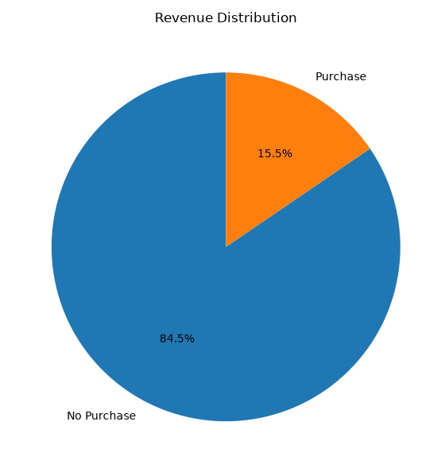
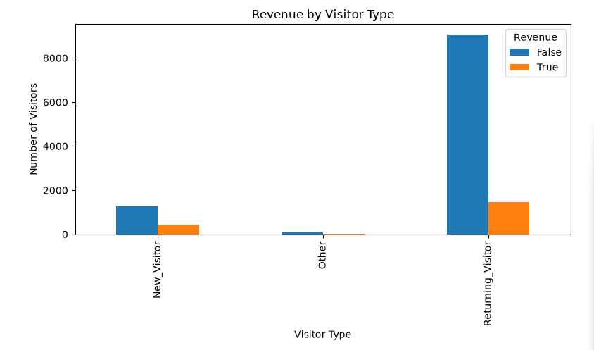
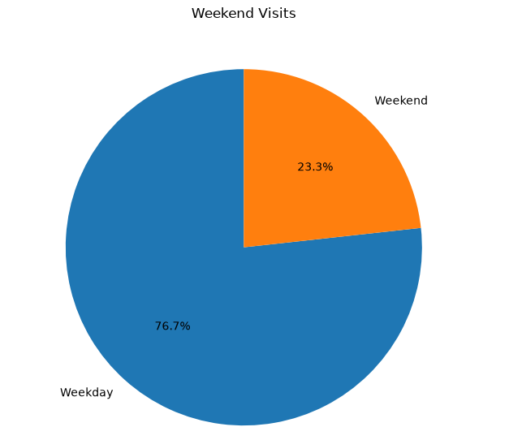
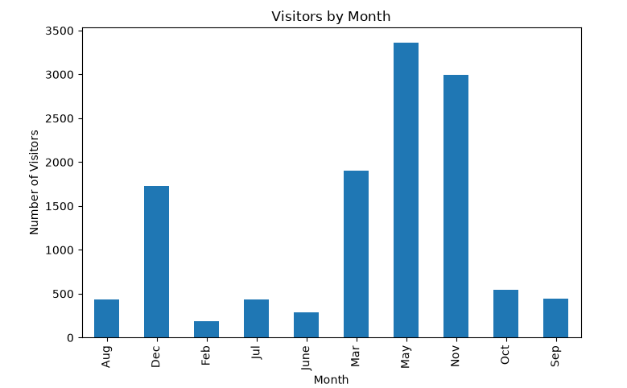
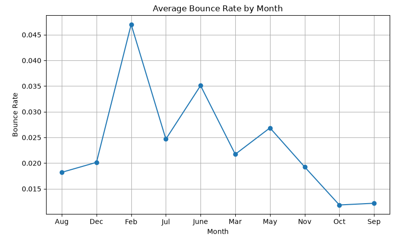
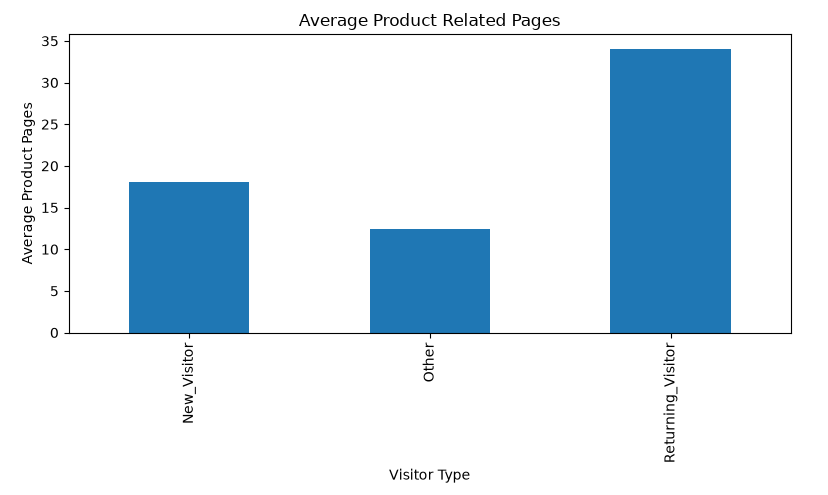
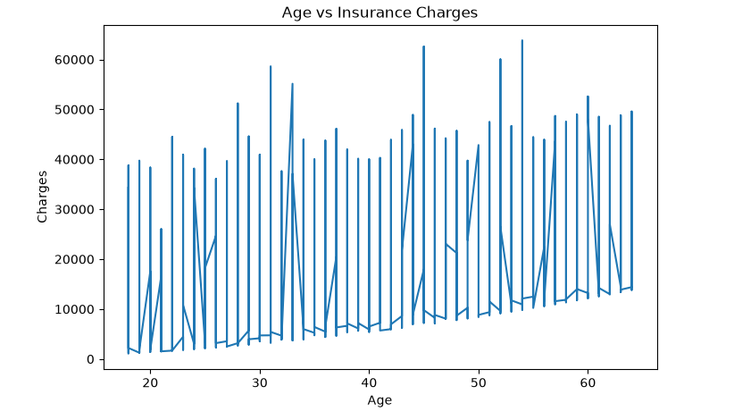
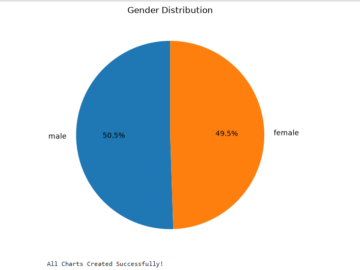
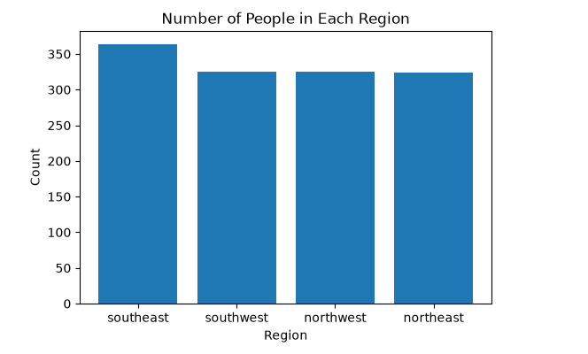

# 📊 Data Science Internship Project

## 📌 Project Overview

This repository contains all the work completed during my **14-Day Data Science Internship**. Throughout the internship, I learned and implemented data analysis, data cleaning, exploratory data analysis (EDA), data visualization, and data export using Python and its data science libraries.

## 🛠️ Tools & Technologies

- Python
- Pandas
- NumPy
- Matplotlib
- VS Code
- Jupyter Notebook
- GitHub

## 📂 Datasets Used

### 1. Insurance Dataset
Tasks performed:
- Data Cleaning
- Data Filtering
- Exploratory Data Analysis (EDA)
- Data Visualization
- Data Export

### 2. Online Shoppers Intention Dataset
Tasks performed:
- Data Cleaning
- Missing Value Handling
- Data Analysis
- Data Visualization
- Exporting Cleaned Dataset

## 📁 Repository Contents

### 🐍 Python Files
- Day_1_Codomax.py
- Day_2_PythonBasics.py
- Day3_NumPyTasks.py
- Day4_Pandasbasics.py
- Day5_Datacleaning.py
- Day6_Data_Filtering.py
- Day7_Data_Analysis.py
- Day8_DataVisualization.py
- Day9_Dashboard.py
- Day10_ExportData.py

### 📓 Notebook
- Final_Project.ipynb

### 📄 Datasets
- insurance.csv
- insurance_filtered.csv
- online_shoppers_intention.csv
- online_shoppers_cleaned.csv

## 📊 Visualizations

### Revenue Distribution

### Revenue by Visitor Type

### Weekend Visits

### Visitors by Month

### Average Bounce Rate by Month

### Average Product Related Pages

### Age vs Insurance Charges

### Gender Distribution

### Region Distribution

## 🎯 Key Features

- Data Cleaning & Preprocessing
- Missing Value Handling
- Data Filtering
- Exploratory Data Analysis (EDA)
- Data Visualization
- Dataset Export
- GitHub Project Documentation

## 📚 Learning Outcomes

During this internship, I gained practical experience in:

- Python Programming
- NumPy
- Pandas
- Data Cleaning & Preprocessing
- Exploratory Data Analysis (EDA)
- Data Visualization using Matplotlib
- GitHub Version Control
- Real-world Data Analysis

## 👩‍💻 Author

**Sravani Velpula Venkata**  
B.Tech – Computer Science & Engineering (Data Science)

---
⭐ If you found this project useful, feel free to explore the repository!
